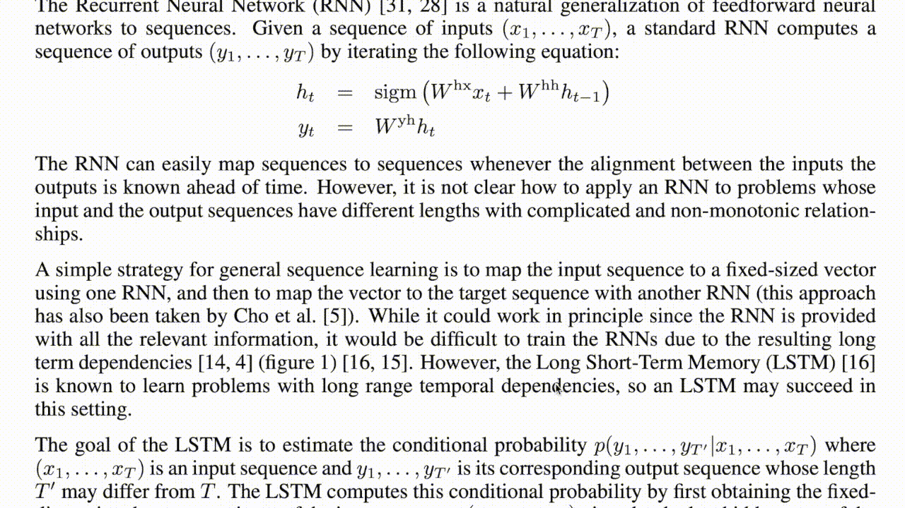

# Image2LaTeX

English | [中文](https://github.com/blaisewang/img2latex-mathpix/blob/master/README-ZH.md#readme)

[](https://www.codacy.com/manual/blaisewang/img2latex-mathpix)
[](https://travis-ci.com/blaisewang/img2latex-mathpix)
[](https://github.com/blaisewang/img2latex-mathpix/releases)
[](https://github.com/blaisewang/img2latex-mathpix/releases)
[](http://makeapullrequest.com)
[](https://github.com/blaisewang/img2latex-mathpix/blob/master/LICENSE)

[Snip](https://mathpix.com/) is an amazing app built by Mathpix to help you extract LaTeX (also text) from documents.
It gives you the first 50 snips for free every single month.
With the help of [MathpixOCR](https://mathpix.com/ocr/) and this supplementary app, you can now make up to 1000 OCR requests per month for free.

[Image2LaTeX](https://github.com/blaisewang/img2latex-mathpix/) is a personal side project that keeps only core functions of the Snip such as convert images to certain LaTeX equation formats and OCR.
For other advanced functions and unlimited snips, subscribe to the Snip for $4.99 per month.

## Features

See the [features](https://mathpix.com/ocr#features) section on MathpixOCR website.

### New Features

- New `Improved OCR` option for [multiple choice](https://mathpix.com/blog/mathpix-text-endpoint), [paragraphs](https://mathpix.com/blog/snip-2.0), [basic table](https://mathpix.com/blog/v1-table-recognition) OCRs, and more.
- HTTP proxy support for making OCR request.

## Requirements

- Your API keys in your [MathpixOCR dashboard](https://dashboard.mathpix.com/) (different from the Mathpix account used in the Snip app)
- JDK 11 or higher version ([OpenJDK](https://openjdk.java.net/) is highly recommended) if you plan to use `Image2LaTeX-x.x.x.jar`

## Run

Enter your API keys (without single quotes) at the first launch of this app.

To change your API keys, macOS and Windows users will find the `API Credentials` tab in the `Preferences` menu item by clicking this app's menu bar icon.

Linux users can open the `Preferences` panel by right-clicking anywhere inside the application.

**Note**, this app will not send your API keys to others except for MathpixOCR API server (see [OCRRequestHelper.java](https://github.com/blaisewang/img2latex-mathpix/blob/master/src/main/java/io/OCRRequestHelper.java) to learn how your API keys are used).

## Usage

### macOS

Run `Image2LaTeX.app`.

### Windows

Run `Image2LaTeX.vbs` at `Image2LaTeX-windows/`.

### Linux

Run `Image2LaTeX` at `Image2LaTeX-linux/bin/` or with:

```bash
./Image2LaTeX
```

### JAR

With a JAR launcher installed, run `Image2LaTeX-x.x.x.jar` or with:

```bash
java -jar Image2LaTeX-x.x.x.jar
```

Use your operating system's default methods (or other tools) to take a screenshot of equations or text (Shift (⇧)-Control (⌃)-Command (⌘)-4 on macOS by default).

Then, press the `Space` key to preview the screenshot.
Or, press the `Return` or `Enter` key to send the OCR request.

See [demo](#Demo) section below.

## Demo



## FAQ

### Native self-contained executable application for Windows and Linux

Not yet. But, with the GA release of Java 14 in 2020, [jpackage](https://jdk.java.net/jpackage/) should be available for packaging self-contained JavaFX application.

### Difference between released `*.jar` and `*.zip` files

You don't need to have JDK 11 installed for running `*.zip` versions.

### Getting updates on new releases ASAP

See this [article](https://help.github.com/en/github/receiving-notifications-about-activity-on-github/watching-and-unwatching-releases-for-a-repository) about watching and unwatching releases for a repository by GitHub.

## Issues

Please first refer to the official [API Docs](https://docs.mathpix.com/#error-id-types) about error types and the [reported issue](https://github.com/blaisewang/img2latex-mathpix/issues) if you encountered an error.

### Encountered an unreported issue 🤔

Welcome to open an [issue](https://github.com/blaisewang/img2latex-mathpix/issues) with the [bug](https://github.com/blaisewang/img2latex-mathpix/labels/bug) or [question](https://github.com/blaisewang/img2latex-mathpix/labels/question) label, but the time to fix non-vital bugs may not be guaranteed.

## Contributions

Contributions are highly welcomed.
Suggestions can be made through opening an [issue](https://github.com/blaisewang/img2latex-mathpix/issues) with [enhancement](https://github.com/blaisewang/img2latex-mathpix/labels/enhancement) label.
[Pull Requests](https://github.com/blaisewang/img2latex-mathpix/pulls) including bug fixes, new features, code style guidance, etc., will be reviewed as soon as possible.

## Contributors ✨

<!-- ALL-CONTRIBUTORS-LIST:START - Do not remove or modify this section -->
<!-- prettier-ignore-start -->
<!-- markdownlint-disable -->
<table>
  <tr>
    <td align="center"><a href="https://nyxflower.github.io/"><br /><sub><b>Hao Xu</b></sub></a><br />🤔</td>
    <td align="center"><a href="http://blog.gongyan.me"><br /><sub><b>龚焱</b></sub></a><br />🤔 ✅</td>
    <td align="center"><a href="https://github.com/wtbsw"><br /><sub><b>BOB</b></sub></a><br />🐛 ⚠️</td>
    <td align="center"><a href="https://github.com/YuiTH"><br /><sub><b>YuiTH</b></sub></a><br />🐛</td>
  </tr>
</table>

<!-- markdownlint-enable -->
<!-- prettier-ignore-end -->
<!-- ALL-CONTRIBUTORS-LIST:END -->

## License

This code is distributed under the terms of the [Apache License 2.0](https://github.com/blaisewang/img2latex-mathpix/blob/master/LICENSE).
